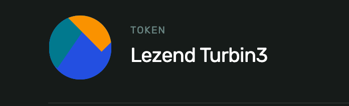
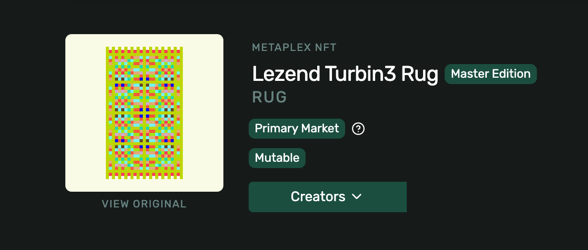

# Lezend's Turbin3 Q4 Builders cohort work

This repository contains the work I completed as part of the Turbin3 Q4 2024 Builders cohort.

**Dev Wallet**: `9fBPHthnGU2SBaSifXhDw526q2R27HBjt7VyJi67bX8z`

I replaced Yarn with the Bun package manager due to personal preference, as Bun is newer, faster, and gaining popularity. If Bun becomes problematic at any point, it can easily be reverted back to Yarn by deleting the `bun.lockb` file and running `yarn install` again.

[Bun Docs](https://bun.sh/docs)

## Week-1

- Minted an SPL token with metadata and conducted test transfers on devnet.
**Token address**: `7DT1DrgoPYnWTaGyZkHW3qjr7cKTTbKsvHqH6diSNC18`

- Created and minted an NFT with metadata and an image on devnet using Metaplex’s UMI framework.
**NFT address**: `8hs7LbyjZASixveLrtgpdQZa9cCc5heDWYcgsySyBgEC`

