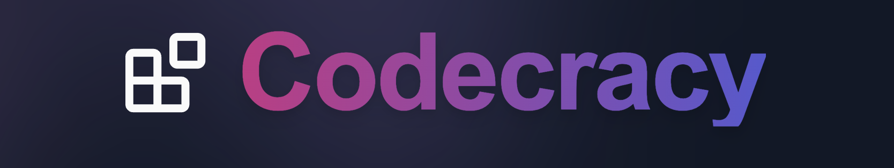

# Lezend's Turbin3 Q4 Builders Cohort Portfolio

This repository showcases the projects and work completed during the Turbin3 Q4 2024 Builders cohort.

**Developer Wallet**: `9fBPHthnGU2SBaSifXhDw526q2R27HBjt7VyJi67bX8z`

## Codecracy (Capstone Project)

> Incentivize Code Contributions with Blockchain

**Website**: [Codecracy](https://codecracy.vercel.app/)  
**Devnet Address**: `j8RWHX7RcLfWxkimpbgrSv6cPjUdpdGvjj3n3ikd53S`  
**Documentation and Repository**: [Codecracy GitHub](https://github.com/thelezend/codecracy)

## Additional Learning Outcomes

### Week-1

- Minted an SPL token with metadata and conducted test transfers on devnet.
    **Token address**: `7DT1DrgoPYnWTaGyZkHW3qjr7cKTTbKsvHqH6diSNC18`
    

- Created and minted an NFT with metadata and an image on devnet using Metaplex’s UMI framework.
    **NFT address**: `8hs7LbyjZASixveLrtgpdQZa9cCc5heDWYcgsySyBgEC`
    

### Week-2

- [Vault Program](/programs/vault-program): Developed a basic Solana vault program enabling users to deposit and withdraw SOL, accompanied by comprehensive tests for all instructions.

- [Escrow Program](/programs/escrow-program): Developed an escrow program enabling two users to securely swap tokens without requiring a centralized counterparty. The implementation includes all relevant test cases to ensure reliability and accuracy.

- [NFT Staking Program](/programs/nft-staking-program/): Implemented an NFT staking program that allows users to stake their NFTs for a specified minimum freeze period and earn rewards for their commitment. Comprehensive tests are included to ensure reliability and accuracy.

### Week-3

- [Anchor AMM Program](/programs/anchor-amm): Developed an Anchor AMM program enabling users to create and interact with a decentralized exchange (DEX) for trading tokens.

- [Anchor Marketplace Program](/programs/anchor-marketplace): Developed an Anchor Marketplace program enabling users to list, buy, and sell NFTs on a decentralized marketplace.

## Conclusion

This portfolio represents my journey and growth throughout the Turbin3 Q4 2024 Builders cohort. It showcases a range of projects from basic token creation to complex decentralized applications, demonstrating my evolving skills in blockchain development on the Solana network. Each project has contributed to my understanding of smart contract development, testing, and deployment in the Solana ecosystem.

For more information about any of these projects or to connect with me, please visit my GitHub profile or reach out via Discord.

Thank you for exploring my Turbin3 Q4 Builders Cohort Portfolio!
